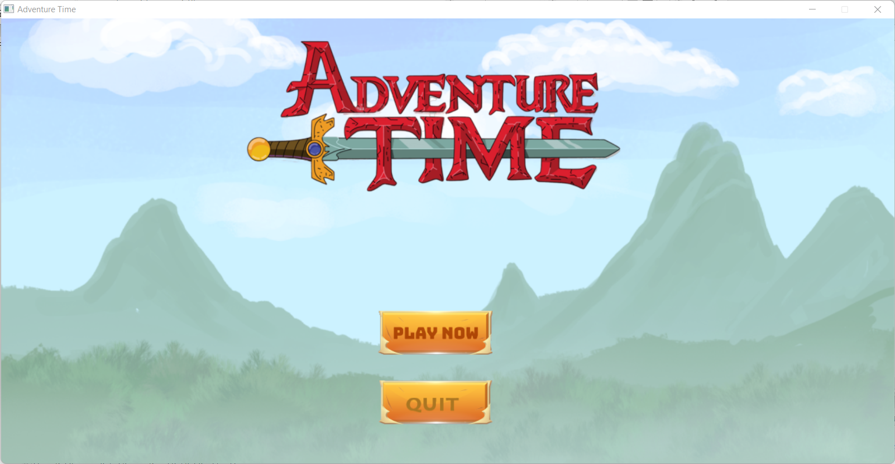
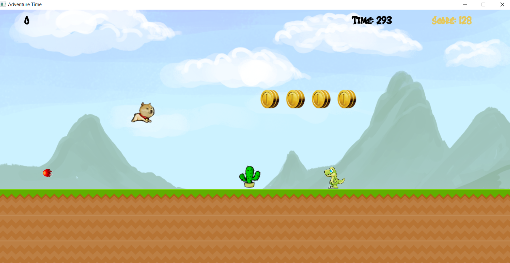
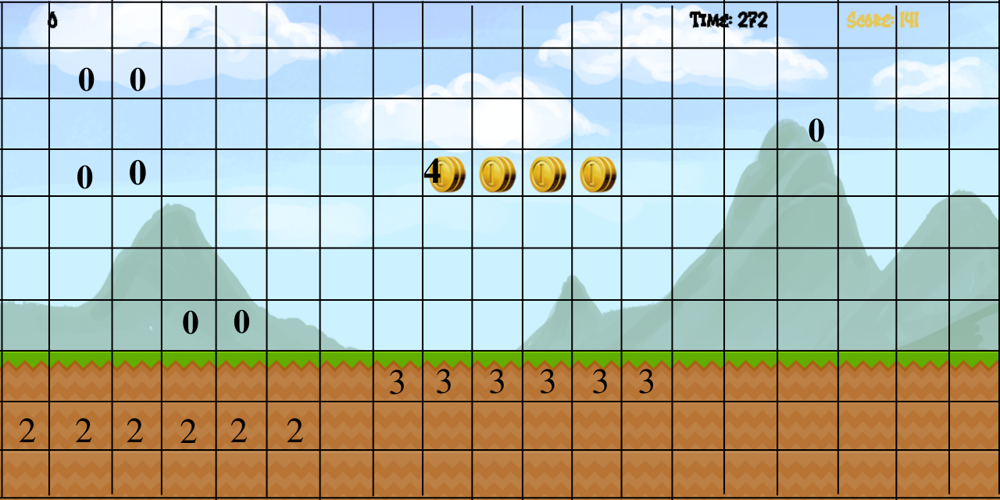
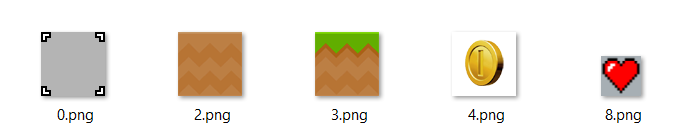

# Adventure_Time
## Giới thiệu
* Họ và tên : Phạm Hoàng
* MSV: 21020324

## Mục lục
1. Mô tả chung về trò chơi
2. Hướng dẫn cài đặt
3. Các chức năng của trò chơi
4. Các kĩ thuật lập trình được sử dụng
5. Kết luận và hướng phát triển

## 1. Mô tả chung về trò chơi
* Adventure Time là một trò chơi được lấy cảm hứng từ tựa game Dino kinh điển trên Google, đồng thời đã được phát triển thêm một số tính năng và tăng độ khó cho game. Đây sẽ là một trải nghiệm chơi game mới lạ nhưng đồng thời cũng khá quen thuộc với người chơi ở mọi lứa tuổi.
* Game được xây dựng bằng ngôn ngữ lập trình C++ kết hợp với việc sử dụng các thư viện đồ hoạ **SDL2**, **SDL2 image**, **SDL2 mixer**, **SDL2 ttf**.




## 2. Hướng dẫn cài đặt
* ***Bước 1***: Cài đặt phần mềm CodeBlocks.
* ***Bước 2***: Tải các thư viện hỗ trợ SDL: SDL2, SDL2_mixer, SDL2_image, SDL2_ttf.
* ***Bước 3***: Cài đặt các thư viện đã tải về vào CodeBlocks.
   - Các bạn có thể tham khảo cách cài đặt thư viện SDL2 vào CodeBlocks theo hướng dẫn trong video https://www.youtube.com/watch?v=dC77R3MYjcU&list=PL-IbDGFpCvtluDVQSSslFYzFueSbjDvZO và làm tương tự với các thư viện còn lại
* ***Bước 4***: Tải Project game về máy dưới dạng file ZIP hoặc bằng câu lệnh:
```
git clone https://github.com/PhamHoang16/Adventure_Time.git
```
* ***Bước 5***: Mở Project trong CodeBlocks bằng cách mở file SuperDino.cbp trong thư mục Game
* ***Bước 6***: Chạy chương trình và chơi Game!!

## 3. Các chức năng của trò chơi
 * Người chơi sử dụng bàn phím hoặc chuột để điều khiển nhân vật chính là chú chó Doge meme nổi tiếng để vượt qua các chường ngại vật và tiêu diệt các quái vật trong game.
 
 * Doge sẽ chạy trên bản đồ và việc của bạn là điều khiển chú vượt qua chướng ngại vật, bắn đạn để tiêu diệt kẻ địch.
 * Với mỗi lần hạ được kẻ địch, các bạn sẽ được cộng thêm 100 điểm. Số điểm bạn dành được cũng hiện ngay trên góc phải của màn hình
 * Doge cũng có thể thu thập tiền vàng nằm trên bản đồ.
 * Cách chơi:
    * Bấm nút Space trên bàn phím hoặc nháy chuột phải để Doge nhảy.
    * Bấm nút chuột trái để Doge bắn ra đạn.
* Tốc độ game tăng dần sau các mốc thời gian để tăng độ khó cho game.
* Game có thể chơi lại nhiều lần với các nút bấm trên Menu

## 4. Các kĩ thuật lập trình được sử dụng
* Kĩ thuật Tile Map: 
   * Chia nhỏ bản đồ thành mạng lưới các ô vuông. Các ô vuông mang một chỉ số nhất định.
   
   
   * Dữ liệu của các ô tilemap được lưu trữ dưới dạng mảng 2 chiều.
   * Sẽ có các loại ô Map. Khi load map, các loại ô Map sẽ được chèn vào những ô chứa chỉ số tương ứng.
    
* Struct và Class
   * Được sử dụng để quản lý các đối tượng và thuộc tính của chúng. Các đối tượng ở đây bao gồm: nhân vật chính, các kẻ địch và chướng ngại vật, các viên đạn bắn.
* Vector
   * Danh sách các viên đạn bắn và danh sách các chướng ngại vật cũng như các kẻ địch được lưu trữ thành các Vector thuận lợi cho việc quản lý.
* Con trỏ
* Xâu
* Lập trình hướng đối tượng, vận dụng tính đóng gói, kế thừa,...
* Sử dụng thư viện đồ hoạ SDL2, thư viện SDL2_image để load các tấm ảnh, SDL2_mixer để tạo hiệu ứng âm thanh, SDl2_ttf để viết các ký tự lên màn hình.

* Các nguồn tham khảo để xây dựng game:
  * Học SDL trên bài giảng của các thầy, trên https://lazyfoo.net và Blog Phattrienphanmem123az.com
  * Tham khảo phương pháp lập trình hướng đối tượng và Tile Map trên Blog Phattrienphanmem123az.com
  * Hình ảnh, âm thanh được sưu tập từ nhiều nguồn khác nhau trên Internet đồng thời có design lại để hình ảnh đẹp và phù hợp với game.

## 5. Kết luận và hướng phát triển
* Việc phân chia object ra thành từng class trong lập trình rất quan trọng vì với cách làm này, ta có thể dễ dàng hơn trong việc lên ý tưởng cũng như sửa nếu có lỗi không mong muốn xảy ra. Ngoài ra, nó còn giúp người đọc code dễ dàng nhận ra chương trình của mình đang làm gì.
* Trong tương lai, Game sẽ còn được phát triển với nhiều tính năng hơn:
  * Chọn nhân vật, loại vũ khí và bản đồ chơi
  * Lưu các người chời đạt điểm cao
  * Có thể ăn các phụ trợ trên bản đồ để nâng cấp vũ khí, nhân vật
  * ......
* Những điều tâm đắc sau khi hoàn thiện Project:
  * Đã vận dụng được các kiến thức học trong môn Lập trình nâng cao
  * Nâng cao kỹ năng lập trình cho bản thân.
  * Có thể hiểu sâu hơn về các kĩ thuật Lập trình hướng đối tượng, Class, tính kế thừa.
  * Rèn được tính kiên nhẫn, cẩn thận và tìm tòi những điều mới.


##    Cảm ơn mọi người đã dành thời gian cho dự án Adventure Time!!!

